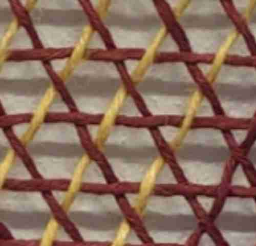
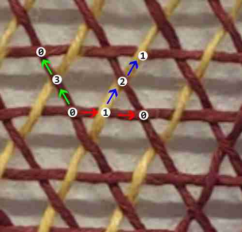

# How to Create JSON Files for Yarn Mesh in LAMMPS

This guide will walk you through the process of creating JSON files to represent a mesh of yarns for export to LAMMPS. We will start with the easier **approach 1**, which involves identifying how yarns repeat in a pattern.

## Step 1: Analyze yarn crossings and repetition

In this step, we'll examine the crossings in the yarn pattern and identify how yarns repeat along their path over this pattern. This will help us understand the structure and repetition of yarns in the JSON file.

1. Start by visualizing the yarn pattern, paying close attention to the crossings where the yarns intersect with each other.

2. Examine the path of individual yarns as they weave through the crossings. Note how the yarns navigate over, under, or around other yarns and the specific pattern they follow.

3. Identify any repetition or regularity in the yarn's path as it repeats across the pattern of crossings. This may include the number of times the yarn goes over or under other yarns before returning to a specific position, or any other repeating sequence. Calculate the distances between nodes.

4. Once you have identified the repetition pattern, determine the number of yarns that are involved in this repetition. This will help when defining the structure of the JSON file.

---

## Step 2: Identify nodes and paths for describing repetitions

In this step, we will identify the nodes necessary for describing the repetitions in the yarn pattern. It's important to note that defining the smallest unit cell is **not needed** in this approach.

To make it easier to identify the yarn pattern, it can be helpful to visualize it. You can sketch the pattern on a paper or use a software tool to draw it digitally. This will provide a clear understanding of how the yarns are arranged and repeated.

Let's use the following lace example:


There are at least three yarns that repeat multiple times in this pattern. For instance, starting from the crossing at node `0`, follow the yarn path indicated by the red arrow. This yarn goes to node `1` and then repeats in a similar manner. Yarns described by green and blue paths repeat in a similar way.



Assuming that the distance between `0` and `1` is equal to 6.0 units and the angle made by the triangles is equal 60°, then we can fill the nodes section:

```json
{
    "nodes": {
        "0": [0.0, 0.0],
        "1": [6.0, 0.0],
        "2": [9.0, 5.196],
        "3": [3.0, -5.196]
    },
```
and the paths section for each path (note that in the easy **approach 1** there is no need to write the shifts section):

```json
{
    "paths": [
        {
            "path": [0, 1, 0],
            "shifts": {
            }
        },
        {
            "path": [1, 2, 1],
            "shifts": {
            }
        }
        {
            "path": [0, 3, 0],
            "shifts": {
            }
        }
    ],
```

---

Continue with the subsequent steps, providing instructions that expand on this approach and lead to the completion of the JSON file for the yarn mesh.

## Step 3: Determine Yarn Properties

Next, identify the properties of the yarns that you want to include in the JSON file. This may include dimensions, density, thickness, and material properties. These properties will be used to define each yarn in the JSON file.

## Step 4: Define JSON File Structure

Based on the yarn pattern and properties, create the structure for the JSON file. Start with an outer object that represents the yarn mesh. This object will contain all the necessary properties and arrays for yarns.

Example structure:

```json
{
  "yarn_mesh": {
    "dimensions": {
      "width": 10,
      "height": 10,
      "depth": 10
    },
    "yarns": []
  }
}
```

In this example, we have a `yarn_mesh` object with `dimensions` and an empty array for `yarns`. We will populate this array in the following steps.

---

You can continue building the how-to document by adding more steps and details as needed.