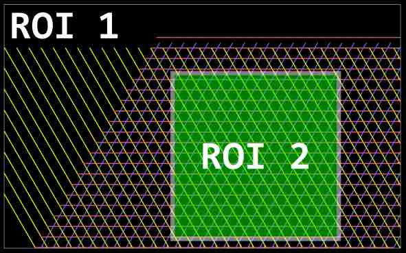

# How to Create JSON Files for Yarn Mesh in LAMMPS

This guide will walk you through the process of creating JSON files to represent a mesh of yarns for export to LAMMPS. We will start with the easier **approach 1**, which involves identifying how yarns repeat in a pattern.

## Step 1: Analyze yarn crossings and repetition

In this step, we'll examine the crossings in the yarn pattern and identify how yarns repeat along their path over this pattern. This will help us understand the structure and repetition of yarns in the JSON file.

1. Start by visualizing the yarn pattern, paying close attention to the crossings where the yarns intersect with each other.

2. Examine the path of individual yarns as they weave through the crossings. Note how the yarns navigate over, under, or around other yarns and the specific pattern they follow.

3. Identify any repetition or regularity in the yarn's path as it repeats across the pattern of crossings. This may include the number of times the yarn goes over or under other yarns before returning to a specific position, or any other repeating sequence. Calculate the distances between nodes.

4. Once you have identified the repetition pattern, determine the number of yarns that are involved in this repetition. This will help when defining the structure of the JSON file.

---

## Step 2: Identify nodes and paths for describing repetitions

In this step, we will identify the nodes necessary for describing the repetitions in the yarn pattern. It's important to note that defining the smallest unit cell is **not needed** in this approach.

To make it easier to identify the yarn pattern, it can be helpful to visualize it. You can sketch the pattern on a paper or use a software tool to draw it digitally. This will provide a clear understanding of how the yarns are arranged and repeated.

Let's use the following lace example:


There are at least three yarns that repeat multiple times in this pattern. For instance, starting from the crossing at node `0`, follow the yarn path indicated by the red arrow. This yarn goes to node `1` and then repeats in a similar manner. Yarns described by green and blue paths repeat in a similar way.


Assuming that the distance between `0` and `1` is equal to 6.0 units and the angle made by the triangles is equal 60°, then we can fill the nodes section:

```json
{
    "nodes": {
        "0": [0.0, 0.0],
        "1": [6.0, 0.0],
        "2": [9.0, 5.196],
        "3": [-3.0, 5.196]
    },
```
and the paths section for each path (note that in the easy **approach 1** there is no need to write the shifts section):

```json
    "paths": [
        {
            "path": [0, 1, 0],
            "shifts": {
            }
        },
        {
            "path": [1, 2, 1],
            "shifts": {
            }
        },
        {
            "path": [0, 3, 0],
            "shifts": {
            }
        }
    ],
```

Special note: in **approach 1** it does not matter if you repeat nodes. In this example, nodes `2` and `3` correspond to equivalent crossings.

---

## Step 3: Yarn features

In this step, we will enhance the description of the yarns by adding several features that provide more detail about their structure and position. We will add five components to describe each one of the yarns:

1. **Path selection**: Select which path describes the yarn. 
   
2. **Starting Node**: Declare the starting node for each yarn. 

3. **Start Path Position**: Specify the starting position of the yarn's path (in the **approach 1** we are declaring 1 path per yarn and, therefore, this value is likely to be set to 0).
   
4. **Z Signal**: This feature declares if the yarn is positioned on the top or bottom at the crossing.
   
5. **Z Coordinate Variation**: The final feature describes how much the z coordinate varies between nodes. A small value for $Z_0$ may cause intersections at crossings, while a larger $Z_0$ could make the structure excessively wavy.

For previous example, the following json section can be filled as:

```json
	"unit_yarns": {
		"0": [0, 0, 0, 1, 1.0],
		"1": [1, 1, 0, 1, 1.0],
		"2": [2, 0, 0,-1, 1.0]
	},
```

---

## Step 4: Define repetions of the unit_yarns

In this step, we'll identify and define two types of repetitions:

1. **Repetition of the yarn unit**: In the first type of repetition, we repeat each yarn pattern such that the yarn appears continuous. [Number of repeating units, vector x coordinate, vector y coordinate]


2. **Repetition of yarns**: The second type of repetition involves repeating the yarns in the pattern. This way, multiple strands of the same yarn appear across the pattern. [Number of repeating units, vector x coordinate, vector y coordinate]

3. **Type of Yarn** Each yarn gets an identifier which can be utilized to alter properties during simulations.


```json
	"unit_repetion":{
		"0": [20, 12.0, 0, 20, 6.0, 10.3923, 1],
		"1": [20, 6.0, 10.3923, 20, 12.0, 0.0, 2],
		"2": [20, -6.0, 10.3923, 20, 12.0, 0.0, 3]
	},
```

---

## Step 5: Define a Region of Interest (ROI)

In this step, we'll use a Region of Interest (ROI) to crop out a portion of the pattern that we want to focus on. You can make the calculations to create the final ROI. However, a straightfoward alternative, explained here, is to create a first wider ROI, then vizualize the generate mesh, and generate a second ROI that will be the final desired lace.

ROI is a selected subset of samples within the data set. It lets you concentrate on specific attributes by isolating them and removing unwanted areas. The repetion pattern is often not orthonormal, therefore the repetion number will likely need to be bigger. 



1. **Defining a 1st ROI** 
   Start by identifying the area in the pattern that you wish to concentrate on. This may involve specifying a certain range of x, y and z coordinates to restrict focus to. 

   Example in markdown for defining an ROI (ROI 1):

```json
	"roi_bounds":{
		"x_min": -30.5,
		"x_max": 360.5,
		"y_min": -0.5,
		"y_max": 240.5,
		"z_min": -2.0,
		"z_max": 2.0
	}
}
```

2. **Visualize and re-define the ROI**:
    Run `lace_maker.py`:
    
    ```
    python lace_maker.py input/json_patterns/pattern3.json --dist_particles=0.25 --units=1.0 --mass=1.0 --threshold=2.5
    ```

    and visualize the data points. Since we are building input files to use on LAMMPS, you can use OVITO ([https://www.ovito.org/](https://www.ovito.org/)) or VMD ([https://www.ks.uiuc.edu/Research/vmd/](https://www.ks.uiuc.edu/Research/vmd/)). For example, using OVITO, you start by (1) loading the data file, (2) deselect the bonds so you have access to the info of Particles coordinates, and then (3) annotate the coordinates for the final ROI.

3. **Update the ROI**:
    After getting the coordinates, change the ROI in the json file:

```json
    	"roi_bounds":{
		"x_min": 105.0,
		"x_max": 255.0,
		"y_min": 3.5,
		"y_max": 150.5,
		"z_min": -2.0,
		"z_max": 2.0
	}
}
```

and regenerate the input file to be used by LAMMPS by running the previous script `lace_maker.py`.
